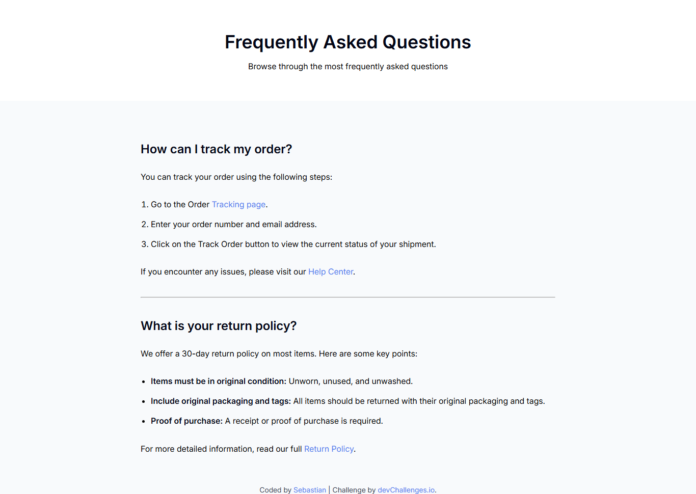

<!-- Please update value in the {}  -->

<h1 align="center">Simple FAQ | devChallenges</h1>

   Solution for a challenge <a href="https://devchallenges.io/challenge/simple-faq-challenge" target="_blank">Simple FAQ</a> from <a href="http://devchallenges.io" target="_blank">devChallenges.io</a>.

  <h3>
    <a href="https://sebascode20.github.io/Simple-Frequently-Asked-Questions-FAQ-/">
      Demo
    </a>
     | 
    <a href="https://github.com/Sebascode20/Simple-Frequently-Asked-Questions-FAQ-?tab=readme-ov-file#what-i-learned">
      Solution
    </a>
     | 
    <a href="https://devchallenges.io/challenge/simple-faq-challenge">
      Challenge
    </a>
  </h3>

<!-- TABLE OF CONTENTS -->

## Table of Contents

- [Overview](#overview)
  - [What I learned](#what-i-learned)
- [Built with](#built-with)
- [Features](#features)
- [Contact](#contact)

<!-- OVERVIEW -->

## Overview

This repository contains a lightweight FAQ page built to satisfy the layout and responsiveness requirements of the [Simple FAQ challenge](https://devchallenges.io/challenge/simple-faq-challenge).

The development process began by crafting a clean semantic HTML structure with two question blocks. Once the markup was in place, I layered on CSS to reproduce the reference design, paying special attention to spacing and typography. A mobile‑first mindset guided the styling: I started with narrow viewports and then used fluid units, `clamp()`, and media‑agnostic flexbox rules to scale gracefully up to desktop widths.

### What I learned

Working through the challenge reinforced best practices for responsive design without relying on JavaScript. Key takeaways included:

- How to use `clamp()` effectively to create fluid typography that adapts between a minimum and maximum size based on viewport width.
- Structuring CSS with custom properties to make theme adjustments easier.
- The advantages of a mobile‑first workflow: start small and rely on natural browser scaling instead of over‑engineering media queries.

I also gained confidence in writing vanilla HTML and CSS that looks polished across a wide range of device sizes.

### Built with

This project was developed using the following core technologies and techniques:

- **HTML5** for semantic markup, ensuring accessibility and structure.
- **CSS3** with custom properties (variables) to maintain consistent styling.
- **Flexbox** layout for vertical centering and flexible main content area.
- **Responsive typography** using `clamp()` to scale headings based on viewport width.
- **Mobile‑friendly meta tags** (`viewport`) for proper scaling on devices.

The challenge did not require a JavaScript framework, so the site is built with vanilla HTML and CSS only.

## Features

- **Semantic markup:** all headings and lists follow HTML5 semantics for accessibility.
- **Responsive layout:** content adapts to phones, tablets, and desktops using flexible units and a mobile‑first design.
- **Custom fonts:** embedded local `Inter` font files for consistent typography.
- **Clean, minimal CSS:** no frameworks, just vanilla CSS with custom properties for easy theming.

This application/site was created as a submission to a [DevChallenges](https://devchallenges.io/challenges-dashboard) challenge.

## Author

- GitHub [@Sebascode20](https://github.com/Sebascode20)
